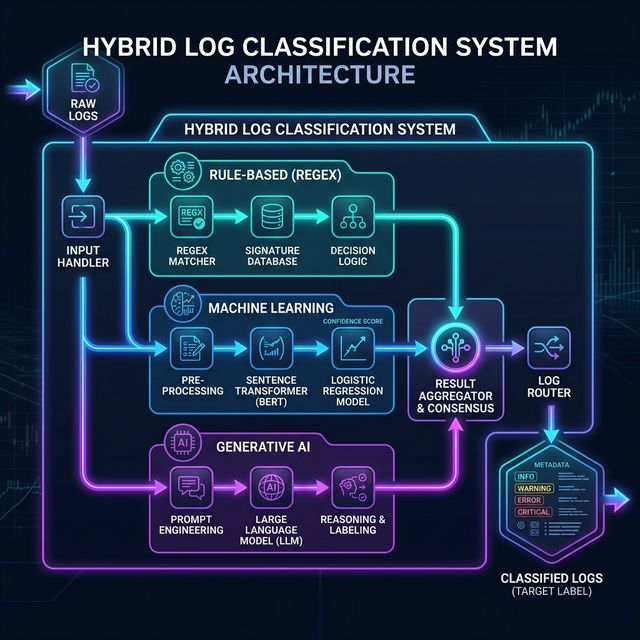

<div align="center">
  
# 🪵 Log Classification & Analysis Framework 🚀

*A robust, hybrid log classification system leveraging Regex, Machine Learning, and Large Language Models (LLMs) to conquer log data of any complexity.*

</div>

---

## ✨ Features & Architecture Approach

This project implements a hybrid framework combining three complementary approaches to handle varying levels of complexity in log patterns. This ensures flexibility and maximum accuracy for predictable, complex, and poorly-labeled data patterns:

| Approach | Technology | Best For | Description |
| :--- | :--- | :--- | :--- |
| ⚡ **Rule-Based** | `Regular Expressions` | **Predictable Logs** | Handles simplified, recurring patterns easily captured using predefined rules. Extremely fast and lightweight. |
| 🧠 **Machine Learning** | `Sentence Transformer + LogReg` | **Complex Logs (Labeled)** | Manages complex patterns given sufficient training data. Generates embeddings using transformers, classified via Logistic Regression. |
| 🤖 **Generative AI**| `Large Language Models (LLMs)`| **Unknown/Unlabeled Logs** | A powerful fallback mechanism. Handles highly complex or altogether unseen patterns where labeled training data is scarce. |

---

## 🏗️ Architecture Flow

<div align="center">
  
</div>

---

## 📂 Project Structure

```text
📦 classification-logs
 ┣ 📂 training/        # 🧠 Code for training Sentence Transformer & LogReg models + regex scripts
 ┣ 📂 models/          # 💾 Saved models (Transformer embeddings & Logistic Regression weights)
 ┣ 📂 resources/       # 📁 Resource files (Test CSVs, output logs, architecture images, etc.)
 ┣ 📜 server.py        # ⚡ FastAPI server code & API endpoints
 ┣ 📜 requirements.txt # 🐍 Python dependencies
 ┗ 📜 README.md        # 📖 Project documentation
```

---

## 🚀 Getting Started

Follow these simple instructions to set up the environment and run the classification server locally.

### 1️⃣ Install Dependencies
Ensure you have Python installed. Install the necessary Python packages by running:
```bash
pip install -r requirements.txt
```

### 2️⃣ Run the API Server
Start the FastAPI application using `uvicorn`:
```bash
python -m uvicorn server:app --reload
```

🌐 **Accessing the Server:**
Once the server is completely up and running, it will be available at:
- **Base Endpoint:** [http://127.0.0.1:8000/](http://127.0.0.1:8000/)
---

## 📊 Usage Guide

Ready to classify your logs? Interacting with the API is straightforward:

1. Upload a **CSV file** containing your raw logs to the FastAPI classification endpoint.
2. Ensure the CSV contains the following mandatory columns:
   - `source` : Specifies the origin of the log.
- `log_message` : The raw log text string to be classified.

#### 2. Making a Request
You can seamlessly query the classification endpoint using the following methods:

**Method A: Using Swagger UI (Easiest)**
1. Navigate to **[http://127.0.0.1:8000/classify/](http://127.0.0.1:8000/classify/)** in your browser.
2. Locate and expand the `POST /classify/` tab.
3. Click "Try it out", upload your CSV file under the `file` field, and click "Execute".

**Method B: Using cURL from the Terminal**
```bash
curl -X 'POST' \
  'http://127.0.0.1:8000/classify/' \
  -H 'accept: text/csv' \
  -H 'Content-Type: multipart/form-data' \
  -F 'file=@your_input_logs.csv' \
  -o classified_output.csv
```

#### 3. Output Generation
Once your file is uploaded and processed through the hybrid framework, the API will instantly return a **downloadable CSV file**. This output file perfectly matches your input, but includes a new dynamically appended column:
- `target_label` : The mathematically and contextually identified category for each log entry.

---

## 📄 Disclaimer

**Copyrights Reserved.** 
This classification architecture is proprietary. Provide proper attribution as necessary.
